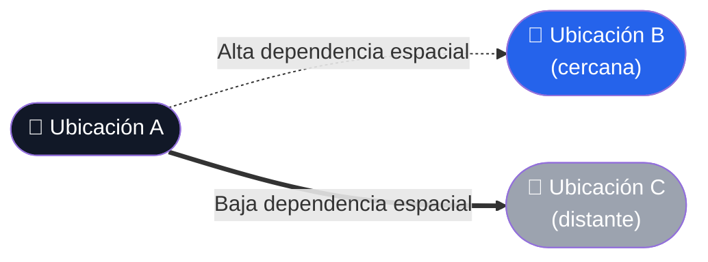

 

 

## Ficha del curso

| | |
|---|---|
|  **Curso** | Estadística Espacial |
|  **Docente** | Ing. Fred Torres-Cruz |
|  **Autor / Estudiante** | Jfer1234567 |
|  **Tipo de repositorio** | Académico — Teoría y Laboratorios |
|  **Periodo** | Ciclo académico vigente |

 

##  Bienvenida

Bienvenidos al **repositorio oficial** del curso de Estadística Espacial. Este espacio tiene como propósito documentar el aprendizaje, los análisis teóricos y los laboratorios prácticos desarrollados durante el ciclo académico.

 

##  Sobre el curso

La **Estadística Espacial** es una rama fundamental de la geografía cuantitativa y la ciencia de datos espaciales. A diferencia de la estadística tradicional, esta disciplina incorpora la **topología**, la **distancia** y la **ubicación** directamente en las matemáticas del análisis.

Todo el fundamento de esta disciplina parte de un principio central:

> [!IMPORTANT]
> ###  Primera Ley de la Geografía — Waldo Tobler
> *"Todo está relacionado con todo lo demás, pero las cosas cercanas están más relacionadas que las cosas distantes."*

 

 

>  Cada práctica se documenta en su propia carpeta, con evidencias, capturas y el detalle metodológico correspondiente.

 

**Repositorio académico mantenido por [Jfer1234567](https://github.com/Jfer1234567)**
Curso dictado por **Ing. Fred Torres-Cruz**

